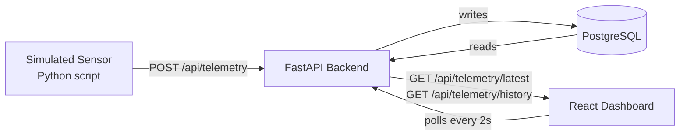

# Architecture

## Data Flow

## Components

| Component        | Technology       | Responsibility                                            |
| ---------------- | ---------------- | --------------------------------------------------------- |
| Sensor simulator | Python class     | Generate wind_speed, calculate power via Betz formula     |
| API              | FastAPI          | Receive telemetry, serve readings, validate with Pydantic |
| Database         | PostgreSQL       | Store time-series readings with timestamp index           |
| Dashboard        | React + Recharts | Poll API every 2s, display live power curve + alerts      |

## API Endpoints

| Method | Endpoint                 | Purpose                   |
| ------ | ------------------------ | ------------------------- |
| POST   | `/api/telemetry`         | Ingest sensor reading     |
| GET    | `/api/telemetry/latest`  | Current turbine state     |
| GET    | `/api/telemetry/history` | Last N readings for chart |

## Physics Model

The Betz limit formula (simplified): P = 0.5 × ρ × A × Cp × v³

Where ρ = 1.225 kg/m³, Cp = 0.35, A = rotor area.
Real turbines use manufacturer power curves — this can be swapped in later via windpowerlib.
