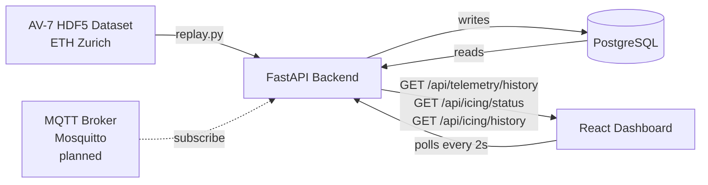

# Architecture

## Data Flow

_(Dashed line = planned, not yet implemented. Everything else below is built and working.)_

## Components

| Component        | Technology         | Responsibility                                  | Status                             |
| ---------------- | ------------------ | ----------------------------------------------- | ---------------------------------- |
| Ingestion script | Python + h5py      | Replay AV-7 HDF5 data row by row to API         | Done                               |
| MQTT subscriber  | Python + paho-mqtt | Accept live sensor data via MQTT protocol       | Planned                            |
| Icing detector   | Python             | IEA T19 power ratio method + persistence filter | Done                               |
| API              | FastAPI            | Receive telemetry, run detector, serve readings | Done                               |
| Database         | PostgreSQL         | Store readings and icing events with timestamps | Done                               |
| Dashboard        | React + Recharts   | Live power ratio chart, icing alerts, event log | Done (visual redesign in progress) |

## API Endpoints

| Method | Endpoint                 | Purpose                        |
| ------ | ------------------------ | ------------------------------ |
| POST   | `/api/telemetry`         | Ingest SCADA reading           |
| GET    | `/api/telemetry/latest`  | Current turbine state          |
| GET    | `/api/telemetry/history` | Last N readings for chart      |
| GET    | `/api/icing/status`      | Current icing detection status |
| GET    | `/api/icing/history`     | Past icing events log          |

## Physics Model

Power ratio = actual_power / expected_power(wind_speed)

Expected power is derived from a parametric curve fitted to the AV-7's
normal operation data in ingestion/explore.ipynb. The IEA Wind Task 19
T19 method defines the detection logic: a sustained power ratio below
threshold (7 of the last 10 readings) triggers an icing event. The
original method's temperature gate was removed — see
[Decision 6](decisions.md) for why.

AV-7 specs: 7kW rated, 12.8m rotor, cut-in 2 m/s, cut-off 14 m/s.
